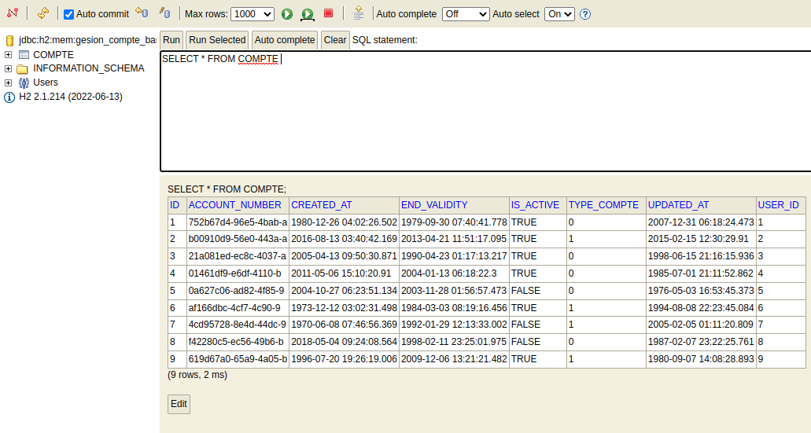

<!DOCTYPE html>
<html lang="en">
<head>
    <meta charset="UTF-8">
</head>
<body>
    <h1>SpringGestionCompteBancaire</h1>
    

    <h2>Table of Contents</h2>
    <ul>
        <li><a href="description">Description</a></li>
        <li><a href="h2">Test on H2 </a></li>
    </ul>
    

      

        

            <h2 id="description">Description</h2>
            <ul>
            <li></li>
            <li></li>
            </ul>
        

      

    

      

        

            <h2 id="#h2">Test on H2</h2>
        

      

      

        

            
        

      

    

</body>
</html>